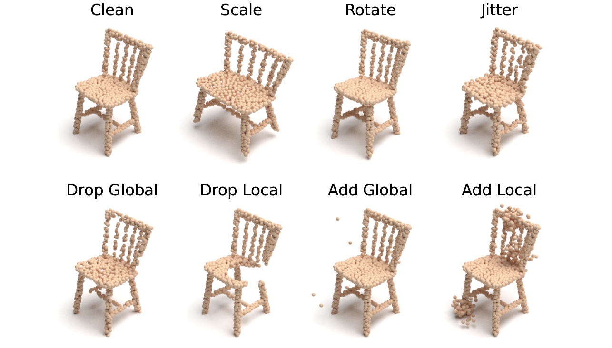

<br />
<p align="center">
  

  <p align="center">
  <strong>Benchmarking and Analyzing Point Cloud Robustness under Corruptions</strong>
    <br>
      <a href="https://scholar.google.com/citations?user=YUKPVCoAAAAJ" target='_blank'>Jiawei Ren</a>,&nbsp;
      <a href="https://scholar.google.com/citations?user=-j1j7TkAAAAJ" target='_blank'>Lingdong Kong</a>,&nbsp;
      <a href="https://scholar.google.com/citations?user=lSDISOcAAAAJ" target='_blank'>Liang Pan</a>,&nbsp;
      <a href="https://scholar.google.com/citations?user=lc45xlcAAAAJ" target='_blank'>Ziwei Liu</a>
    <br>
  S-Lab, Nanyang Technological University
  </p>
</p>

<p align="center">
  <a href="https://arxiv.org/abs/2202.03377" target='_blank'>
    
  </a>
  
  <a href="https://pointcloud-c.github.io/home" target='_blank'>
    
  </a>
  
  <a href="https://zhuanlan.zhihu.com/p/529498676" target='_blank'>
    
  </a>
</p>

## About

<strong>PointCloud-C</strong> is the very first test-suite for <strong>point cloud robustness analysis under corruptions</strong>. It includes two sets: [ModelNet-C](https://arxiv.org/abs/2202.03377) (ICML'22) for point cloud <strong>classification</strong> and [ShapeNet-C]() (arXiv'22) for <strong>part segmentation</strong>.

<br>
<p align="center">
  
  <br>
  Fig. Examples of point cloud corruptions in PointCloud-C.
</p>
<br>

Visit our <a href="https://pointcloud-c.github.io/home" target='_blank'>project page</a> to explore more details. 🌱


## Updates

- \[2022.06\] - PointCloud-C is now live on [Paper-with-Code](https://paperswithcode.com/dataset/pointcloud-c). Join the benchmark today!
- \[2022.06\] - The 1st PointCloud-C challenge will be hosted in conjecture with the ECCV'22 [SenseHuman](https://sense-human.github.io/) workshop. 🚀
- \[2022.06\] - We are organizing the 1st PointCloud-C challenge! Click [here](https://pointcloud-c.github.io/competition.html) to explore the competition details.
- \[2022.05\] - ModelNet-C is accepted to ICML 2022. Click <a href="https://arxiv.org/abs/2202.03377" target='_blank'>here</a> to check it out! 🎉


## Overview

- [Data Preparation](docs/DATA_PREPARE.md)
- [Getting Started](docs/GET_STARTED.md)
- [Benchmark Results](#benchmark-results)
- [Evaluation](#evaluation)
- [Customize Evaluation](#customize-evaluation)
- [Build PointCloud-C](#build-pointcloud-c)
- [TODO List](#todo-list)
- [License](#license)
- [Acknowledgement](#acknowledgement)
- [Citation](#citation)


## Data Preparation
Please refer to [DATA_PREPARE.md](docs/DATA_PREPARE.md) for the details to prepare the ModelNet-C and ShapeNet-C datasets.


## Getting Started
Please refer to [GET_STARTED.md](docs/GET_STARTED.md) to learn more usage about this codebase.


## Benchmark Results

#### ModelNet-C (Classification)

| Method            | Reference                                                  | Standalone |  mCE $\downarrow$ | RmCE $\downarrow$ | Clean OA $\uparrow$ |
| ----------------- | ---------------------------------------------------------- | :--------: | :---: | :---: | :------: |
| DGCNN             | [Wang et al.](https://arxiv.org/abs/1801.07829)            |     Yes    | 1.000 | 1.000 |  0.926   |
| PointNet          | [Qi et al.](https://arxiv.org/abs/1612.00593)              |     Yes    | 1.422 | 1.488 |  0.907   |
| PointNet++        | [Qi et al.](https://arxiv.org/abs/1706.02413)              |     Yes    | 1.072 | 1.114 |  0.930   |
| RSCNN             | [Liu et al.](https://arxiv.org/abs/1904.07601)             |     Yes    | 1.130 | 1.201 |  0.923   |
| SimpleView        | [Goyal et al.](https://arxiv.org/abs/2106.05304)           |     Yes    | 1.047 | 1.181 |  0.939   |
| GDANet            | [Xu et al.](https://arxiv.org/abs/2012.10921)              |     Yes    | 0.892 | 0.865 |  0.934   |
| CurveNet          | [Xiang et al.](https://arxiv.org/abs/2105.01288)           |     Yes    | 0.927 | 0.978 |  0.938   |
| PAConv            | [Xu et al.](https://arxiv.org/abs/2103.14635)              |     Yes    | 1.104 | 1.211 |  0.936   |
| PCT               | [Guo et al.](https://arxiv.org/abs/2012.09688)             |     Yes    | 0.925 | 0.884 |  0.930   |
| RPC               | [Ren et al.](https://arxiv.org/abs/2202.03377)             |     Yes    | 0.863 | 0.778 |  0.930   |
| OcCo (DGCNN)      | [Wang et al.](https://arxiv.org/abs/2010.01089)            |     No     | 1.248 | 1.262 |  0.922   |
| PointBERT         | [Yu et al.](https://arxiv.org/abs/2111.14819)              |     No     | 1.033 | 0.895 |  0.922   |
| PointMixUp (PointNet++) | [Chen et al.](https://arxiv.org/abs/2008.06374)      |     No     | 1.028 | 0.785 |  0.915   |
| PointWOLF (DGCNN) | [Kim et al.](https://arxiv.org/abs/2110.05379)             |     No     | 0.814 | 0.698 |  0.926   |
| RSMix (DGCNN)     | [Lee et al.](https://arxiv.org/abs/2102.01929)             |     No     | 0.745 | 0.839 |  0.930   |
| WOLFMix (DGCNN)   | [Ren et al.](https://arxiv.org/abs/2202.03377)             |     No     | 0.590 | 0.485 |  0.932   |
| WOLFMix (GDANet)  | [Ren et al.](https://arxiv.org/abs/2202.03377)             |     No     | 0.571 | 0.439 |  0.934   |
| WOLFMix (PCT)     | [Ren et al.](https://arxiv.org/abs/2202.03377)             |     No     | 0.574 | 0.653 |  0.934   |
| WOLFMix (RPC)     | [Ren et al.](https://arxiv.org/abs/2202.03377)             |     No     | 0.601 | 0.940 |  0.933   |

#### ShapeNet-C (Part Segmentation)

| Method            | Reference                                                  | Standalone |  mCE $\downarrow$ |   RmCE $\downarrow$  | Clean mIoU $\uparrow$ |
| ----------------- | ---------------------------------------------------------- | :--------: | :---: | :------: | :---: |
| DGCNN             | [Wang et al.](https://arxiv.org/abs/1801.07829)            |     Yes    | 1.000 |   1.000  | 0.852 |
| PointNet          | [Qi et al.](https://arxiv.org/abs/1612.00593)              |     Yes    | 1.178 |   1.056  | 0.833 |
| PointNet++        | [Qi et al.](https://arxiv.org/abs/1706.02413)              |     Yes    | 1.112 |   1.850  | 0.857 |
| OcCo-DGCNN        | [Wang et al.](https://arxiv.org/abs/2010.01089)            |     No     | 0.977 |   0.804  | 0.851 |
| OcCo-PointNet     | [Wang et al.](https://arxiv.org/abs/2010.01089)            |     No     | 1.130 |   0.937  | 0.832 |
| OcCo-PCN          | [Wang et al.](https://arxiv.org/abs/2010.01089)            |     No     | 1.173 |   0.882  | 0.815 |
| GDANet            | [Xu et al.](https://arxiv.org/abs/2012.10921)              |     Yes    | 0.923 |   0.785  | 0.857 |
| PAConv            | [Xu et al.](https://arxiv.org/abs/2103.14635)              |     Yes    | 0.927 |   0.848  | 0.859 |
| PointTransformers | [Zhao et al.](https://arxiv.org/abs/2012.09164)            |     Yes    | 1.049 |   0.933  | 0.840 |
| PointMLP          | [Ma et al.](https://arxiv.org/abs/2202.07123)              |     Yes    | 0.977 |   0.810  | 0.853 |
| PointBERT         | [Yu et al.](https://arxiv.org/abs/2111.14819)              |     No     | 1.033 |   0.895  | 0.855 |
| PointMAE          | [Pang et al.](https://arxiv.org/abs/2203.06604)            |     No     | 0.927 |   0.703  | 0.860 |

*Note: Standalone indicates whether or not the method is a standalone architecture or a combination with augmentation or pretrain.


## Evaluation
Evaluation commands are provided in [EVALUATE.md](docs/EVALUATE.md).


## Customize Evaluation
We have provided evaluation utilities to help you evaluate on ModelNet-C using your own codebase. 
Please follow [CUSTOMIZE.md](docs/CUSTOMIZE.md).


## Build PointCloud-C
You can manage to generate your own "PointCloud-C"! Follow the instructions in [GENERATE.md](docs/GENERATE.md).


## TODO List
- [x] Initial release. 🚀
- [x] Add license. See [here](#license) for more details.
- [x] Release test sets. Download ModelNet-C and ShapeNet-C from our <a href="https://pointcloud-c.github.io/home" target='_blank'>project page</a>.
- [x] Add evaluation scripts for classification models.
- [ ] Add evaluation scripts for part segmentation models.
- [ ] Clean and retouch codebase.


## License
<a rel="license" href="http://creativecommons.org/licenses/by-nc-sa/4.0/"></a>
<br />
This work is under the <a rel="license" href="http://creativecommons.org/licenses/by-nc-sa/4.0/">Creative Commons Attribution-NonCommercial-ShareAlike 4.0 International License</a>.


## Acknowledgement

We acknowledge the use of the following public resources during the course of this work:
<sup>1</sup>[SimpleView](https://github.com/princeton-vl/SimpleView),
<sup>2</sup>[PCT](https://github.com/Strawberry-Eat-Mango/PCT_Pytorch),
<sup>3</sup>[GDANet](https://github.com/mutianxu/GDANet),
<sup>4</sup>[CurveNet](https://github.com/tiangexiang/CurveNet),
<sup>5</sup>[PAConv](https://github.com/CVMI-Lab/PAConv),
<sup>6</sup>[RSMix](https://github.com/dogyoonlee/RSMix),
<sup>7</sup>[PointMixUp](https://github.com/yunlu-chen/PointMixup),
<sup>8</sup>[PointWOLF](https://github.com/mlvlab/PointWOLF),
<sup>9</sup>[PointTransformers](https://github.com/qq456cvb/Point-Transformers),
<sup>10</sup>[OcCo](https://github.com/hansen7/OcCo),
<sup>11</sup>[PointMLP](https://github.com/ma-xu/pointMLP-pytorch),
<sup>12</sup>[PointBERT](https://github.com/lulutang0608/Point-BERT),
and <sup>13</sup>[PointMAE](https://github.com/Pang-Yatian/Point-MAE).


## Citation

If you find this work helpful, please kindly consider citing our papers:

```bibtex
@ARTICLE{ren2022pointcloud-c,
  title={Benchmarking and Analyzing Point Cloud Robustness under Corruptions},
  author={Jiawei Ren and Lingdong Kong and Liang Pan and Ziwei Liu},
  journal={arXiv:220x.xxxxx},
  year={2022}
}
```

```bibtex
@ARTICLE{ren2022modelnet-c,
  title={Benchmarking and Analyzing Point Cloud Classification under Corruptions},
  author={Jiawei Ren and Liang Pan and Ziwei Liu},
  journal={International Conference on Machine Learning (ICML)},
  year={2022}
}
```

