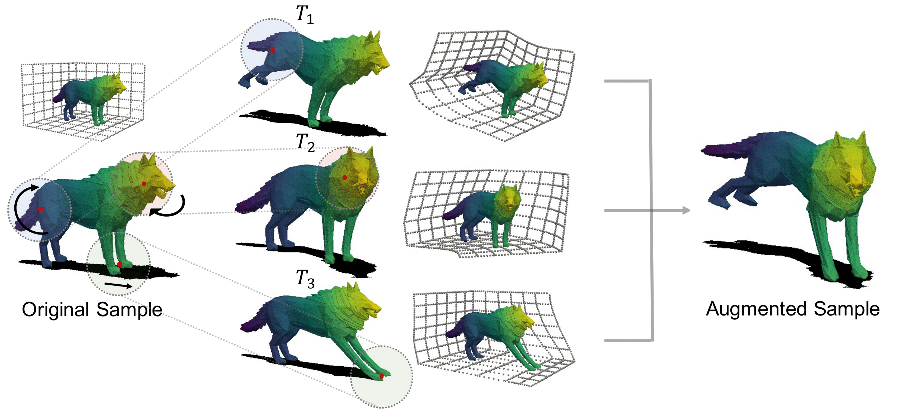

# PointWOLF: Point Cloud Augmentation with Weighted Local Transformations

This repository is the implementation of [PointWOLF](https://openaccess.thecvf.com/content/ICCV2021/html/Kim_Point_Cloud_Augmentation_With_Weighted_Local_Transformations_ICCV_2021_paper.html).

> Sihyeon Kim<sup>1*</sup>, Sanghyeok Lee<sup>1*</sup>, Dasol Hwang<sup>1</sup>, Jaewon Lee<sup>1</sup>, Seong Jae Hwang<sup>2</sup>, Hyunwoo J. Kim<sup>1†</sup>, Point Cloud Augmentation with Weighted Local Transformations (ICCV 2021).  
> <sup>1</sup>Korea University <sup>2</sup>University of Pittsburgh



# Installation
## Dependencies
- CUDA 10.2
- Python 3.7.1
- torch 1.7.0
- packages : sklearn, numpy, h5py, glob

## Download
**Clone repository**  

```
$ git clone https://github.com/mlvlab/PointWOLF.git
```

**Download ModelNet40**  

**Notes** : When you run the `main.py`, ModelNet40 is automatically downloaded at `.../PointWOLF/data/`.  
If you want to download dataset on your `${PATH}`, see below.

```
$ cd ${PATH}
$ wget https://shapenet.cs.stanford.edu/media/modelnet40_ply_hdf5_2048.zip --no-check-certificate
$ unzip modelnet40_ply_hdf5_2048.zip
$ rm modelnet40_ply_hdf5_2048.zip
```

# Runnig the code

**train**

- Run the training without PointWOLF & AugTune:  
```
$ python main.py --exp_name=origin --model=dgcnn --num_points=1024 --k=20 --use_sgd=True
```

- Run the training with **PointWOLF**:  
```
$ python main.py --exp_name=PointWOLF --model=dgcnn --num_points=1024 --k=20 --use_sgd=True --PointWOLF
```

- Run the training with **PointWOLF** & **AugTune**:  
```
$ python main.py --exp_name=PointWOLF_AugTune --model=dgcnn --num_points=1024 --k=20 --use_sgd=True --PointWOLF --AugTune
```


**eval**

- Run the evaluation with trained model located at `${PATH}`:  
```
$ python main.py --exp_name=eval --model=dgcnn --num_points=1024 --k=20 --use_sgd=True --eval=True --model_path=${PATH}
```

# Citation
```
@InProceedings{Kim_2021_ICCV,
    author    = {Kim, Sihyeon and Lee, Sanghyeok and Hwang, Dasol and Lee, Jaewon and Hwang, Seong Jae and Kim, Hyunwoo J.},
    title     = {Point Cloud Augmentation With Weighted Local Transformations},
    booktitle = {Proceedings of the IEEE/CVF International Conference on Computer Vision (ICCV)},
    month     = {October},
    year      = {2021},
    pages     = {548-557}
}
```

# License
[MIT License](https://github.com/mlvlab/PointWOLF/blob/master/LICENSE)

# Acknowledgement
The structure of this codebase is borrowed from [DGCNN](https://github.com/WangYueFt/dgcnn).
