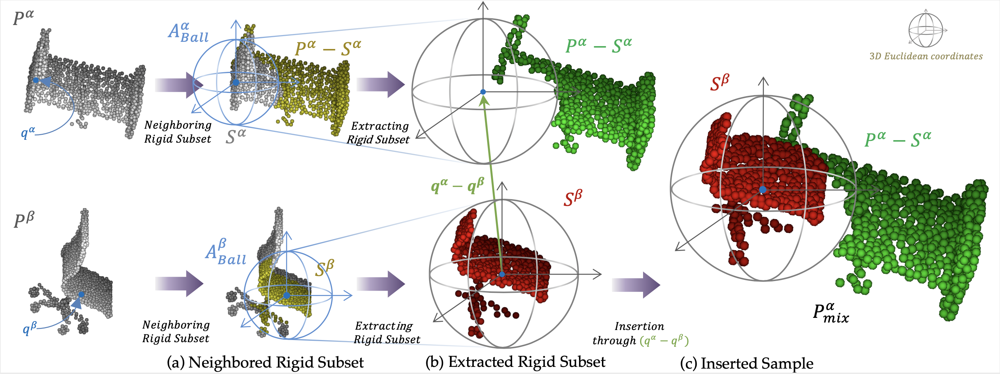

## Regularization Strategy for Point Cloud via Rigidly Mixed Sample (CVPR 2021)

We propose a novel data augmentation method for point cloud, **Rigid Subset Mix (RSMix)**.
Our model is implemented based on **PointNet+++** and **DGCNN**, which are widely used point-wise deep neural networks.

[[arXiv version paper link]](https://arxiv.org/pdf/2102.01929.pdf)

## Overview

`RSMix` generates the virtual sample from each part of the two point cloud samples by mixing them without shape distortion. It effectively generalize the deep neural network model and achieve remarkable performance for shape classification.



## Implementation

### RSMix on PointNet++

- [RSMix-PointNet++(TensorFlow)](./pointnet2_rsmix)

### RSMix on DGCNN

- [RSMix-DGCNN(PyTorch)](./dgcnn_rsmix)

## License

MIT License

## Acknowledgement

The structure of this codebase is borrowed from
[PointNet++](https://github.com/charlesq34/pointnet2/) and [DGCNN-PyTorch](https://github.com/WangYueFt/dgcnn/tree/master/pytorch).

### Citation

If you find our work useful in your research, please consider citing:

```
arXiv:

@article{lee2021regularization,
  title={Regularization Strategy for Point Cloud via Rigidly Mixed Sample},
  author={Lee, Dogyoon and Lee, Jaeha and Lee, Junhyeop and Lee, Hyeongmin and Lee, Minhyeok and Woo, Sungmin and Lee, Sangyoun},
  journal={arXiv preprint arXiv:2102.01929},
  year={2021}
}
```
